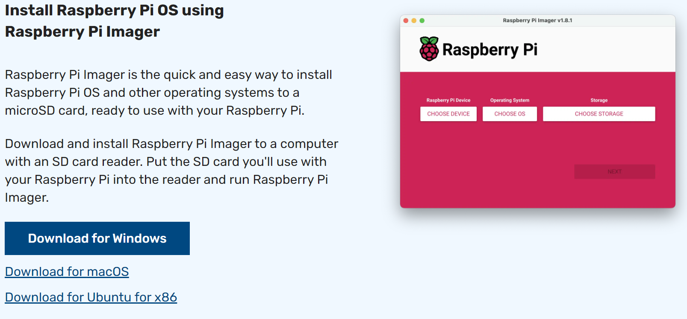
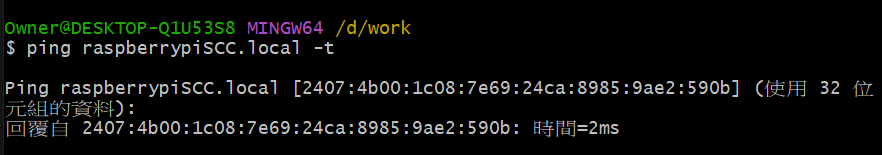

# raspberry_pi

## 在樹莓派上安裝作業系統

- 到官網下載OS，下載完成後會產生一個 imager 的執行檔 ： [Raspberry Pi OS](https://www.raspberrypi.com/software/)

  

- 執行 imager
- 選擇 raspberry pi device：我的是 raspberry pi 4 model B
- 選擇操作系統：目前是設定 raspberry pi OS 64bits
- 選擇儲存卡：SD Card
- 輯輯設定
  - 主機名：raspberrypiSCC.local
  - username：pi
  - password：raspberry
  - WIFI 名稱： LINKOU203-4F-5G
  - WIFI 密碼： xxx
- 開始燒錄
- 燒錄完成後，將SD Card拔除，並插到 raspberry pi 機器上開機即可。
- 確認是否有安裝成功：
  用電腦 ping 機器上的主機名稱，看是否有回應：`ping raspberrypiSCC.local`，如有回應表示已安裝成功。


## 使用 ssh 登入樹莓派

因為目前我的樹莓派沒有外接營幕跟鍵盤，因此只能透過 ssh 登入樹莓派操作。

- 要先知道樹莓派的 ip ，才能連上樹莓派：
  - 手機下載 `Net Analyzer` app，手機、電腦與樹莓派設定相同網域。
  - 開啟 `Net Analyzer` app， 開始 scan，即可找到樹莓派的 ip。

- 在電腦的任何命令列(cmd/ powershell/ Gitbash)上執行：`ssh pi@192.168.1.118`即可登入樹莓派。
  - 因為全新樹莓派預設系統 ssh 是關閉的，所以當第一次 ssh 時，會出現此錯誤訊息，無法連上：`ssh:connect to host 192,168.1.118 port:22 Connection refused`
  - 解決辦法是在SD Card根目錄新增一個`ssh`的空白文件就行了
  - 或是如果有接營幕鍵盤，可以直接下命令直接開啟：
  
    ```linux
    sudo service ssh start
    sudo service ssh status
    ```

## 使用 VNC Viewer 達到遠端桌面功能

因為沒有外接營幕，所以可以使用 VNC Viewer 達到遠端桌面功能。在使用之前要先設定樹莓派的 VNC config 先打開，VNC 才能連上。

- `sudo raspi-config`
- Interface options -> VNC

## 在樹莓派上架設網站

參考此篇教學文章 [How to Host a WordPress Site on Raspberry Pi](https://www.makeuseof.com/tag/host-wordpress-raspberry-pi/)

### 安裝前的前置動作

- `sudo apt update`：apt->Advanced Package Tool 的縮寫，用於管理軟體包的命令工具。update-> apt 的子命令，更新軟體包列表，使系統了解到目前可用的最新軟體包。
- `sudo apt upgrade`：升級系統已安裝的軟體包到最新版本。
- `sudo apt autoremove`：清除系統中已經不需要的軟體包。

### 安裝 Apache Web Server

- `sudo apt install apache2 -y`：安裝 Apache
- `hostname -I`：取得樹莓派 IP 位址
- 在另一台電腦開啟網頁，輸入樹莓派機台網址： `http://192.168.1.118`，確認是否有安裝成功。

### 安裝 PHP

- `sudo apt install php -y`：安裝 PHP
- 完成安裝時，確認PHP是否有安裝成功
  - `cd /var/www/html/`
  - `sudo rm index.html`：刪除之前的 web page
  - `sudo nano index.php`
  - 寫入以下內容：

  ```php
  <?php echo "hello world"; ?>
  <?php echo date('Y-m-d H:i:s'); ?>
  <?php phpinfo(); ?>
  ```

  - 重新啟啟動 Apache：`sudo service apache2 restart`
  - 更新網頁看結果

### 安裝 mariadb

- `sudo apt install mariadb-server php-mysql -y`：安裝 mariadb
- `sudo service apache2 restart`：重新啟動 apache

### 安裝 wordpress

- 進入到html資料夾，並移除所有的檔案：

  ```linux
  cd /var/www/html
  sudo rm *
  ```

- 下載最新版 wordpress：`sudo wget http://wordpress.org/latest.tar.gz`
- 解壓縮：`sudo tar xzf latest.tar.gz`
- 將 wordpress 資料夾內的內容全移到 html 底下：`sudo mv wordpress/* .`
- 移除 wordpress 資料夾及 latest.tar.gz：`sudo rm -rf wordpress latest.tar.gz`
- 設定 Apache 的 user 權限：`sudo chown -R www-data: .`，chown是change owner的意思，www-data 通常是Web伺服器（如ApacheNginx）在執行時的默認使用者和群組。

### Configure MySQL

執行 install command ： `sudo mysql_secure_installation`，並選擇以下選項：
```
Remove anonymous users
Disallow root login remotely
Remove test database and access to it
Reload privilege tables now
```

### 建立 wordpress database

- 先 configure database 以進入 mariadb monitor：`sudo mysql -uroot -p`
- 在 mariadb monitor 命令列中，輸入 `create database wordpress;`，建立 wordpress database
- `GRANT ALL PRIVILEGES ON wordpress.* TO 'root'@'localhost' IDENTIFIED BY 'PASSWORD';`
- `FLUSH PRIVILEGES;`
- 按 `Ctrl+D` 離開 mariadb database magement

### Install and Configure WordPress

開啟劉灠器，並輸入`http://192.168.1.118/`，開始 wordpress 的安裝頁面。
```
資料庫名稱：wordpress
使用者名稱：root
密碼：PASSWORD
其它不用動
```